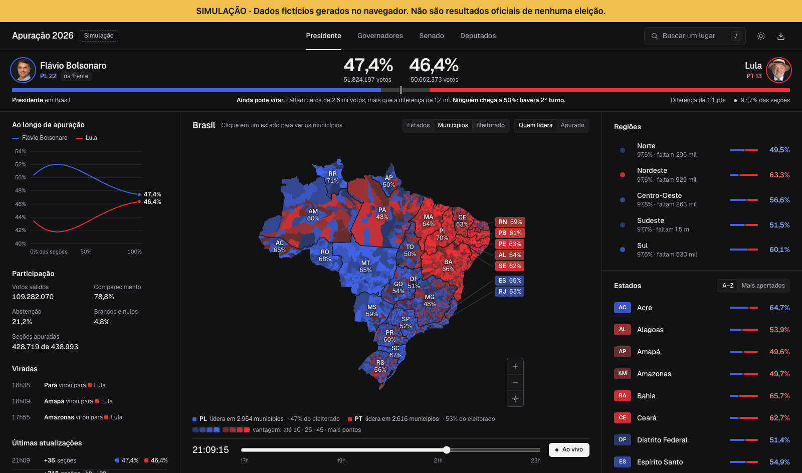

# open-apuracao-brazil



Painel interativo de apuração eleitoral do Brasil: um mapa navegável por estado, município e zona eleitoral, com placar, linha do tempo e andamento da contagem.

> [!WARNING]
> **Todos os resultados são simulados.** Votos, percentuais, comparecimento e ritmo de apuração são gerados no navegador por um modelo determinístico. O projeto não consulta o TSE nem qualquer serviço eleitoral, e nada aqui representa o resultado de uma eleição real. Os nomes de candidatos servem só para dar forma à interface.

## O que tem

- **Mapa em três níveis.** Brasil, os municípios de um estado e as zonas eleitorais de um município (as 57 da capital paulista, por exemplo). São 5.570 municípios desenhados em Canvas 2D, com zoom, arraste e pinça.
- **Modos de mapa.** Recorte por estados, por municípios ou por eleitorado (um círculo por município, com área proporcional ao número de eleitores). Cor por quem lidera e com que vantagem, ou por quanto já foi apurado.
- **Placar do recorte aberto.** Mostra sempre o lugar que você está vendo e responde "ainda pode virar?" comparando os votos que faltam com a diferença atual. Para presidente, diz também se haverá 2º turno.
- **Linha do tempo.** Volte a qualquer minuto entre 17h e 23h, ou acompanhe "ao vivo" a simulação avançando.
- **Andamento.** Gráfico do percentual de cada candidato conforme as seções entram, participação, estados que viraram de lado e os últimos boletins. Clicar num ponto do gráfico leva o mapa àquele momento.
- **Busca** por estado ou município (tecla `/`), **tema claro e escuro** e **download do mapa** em PNG.
- **Tudo na URL.** Lugar, cargo, horário e modo do mapa fazem parte do link, e o botão voltar do navegador sobe um nível no mapa.
- **Responsivo.** Três colunas em telas largas, mapa e painel com abas em telas médias, e uma gaveta sobre o mapa no celular. No desktop a página não rola: o mapa ocupa a altura disponível.

## Como rodar

Requisitos: [Node.js](https://nodejs.org) 20.19 ou mais recente (exigência do Vite 7) e npm.

```sh
git clone https://github.com/bpinheiroms/open-apuracao-brazil.git
cd open-apuracao-brazil
npm install
npm run dev
```

O Vite imprime o endereço local, normalmente http://127.0.0.1:5173. Não há variáveis de ambiente, chaves de API nem backend: depois de carregar os arquivos de `public/`, tudo roda no navegador.

| Comando | O que faz |
| --- | --- |
| `npm run dev` | Servidor de desenvolvimento com recarga automática |
| `npm run build` | Gera o site estático em `dist/` |
| `npm run preview` | Serve o conteúdo de `dist/` para conferência |
| `npm test` | Roda os testes com o executor nativo do Node |

O resultado de `npm run build` é um site estático e pode ser publicado em qualquer hospedagem de arquivos. Os caminhos são absolutos (`/data/...`, `/fonts/...`), então o site precisa ficar na raiz do domínio; para publicar numa subpasta, configure `base` no Vite.

## Como usar

- Clique em um estado para abrir seus municípios e em um município para abrir o recorte dele. O botão com seta acima do mapa, a tecla `Esc` e o voltar do navegador sobem um nível.
- Acima do mapa ficam os controles de recorte (Estados, Municípios, Eleitorado) e de cor (Quem lidera, Apurado).
- Arraste para mover. Use `+`/`−`, a roda do mouse ou a pinça para aproximar.
- Arraste a linha do tempo para mudar o horário; "Ao vivo" volta à simulação em andamento.
- `/` abre a busca; setas e `Enter` escolhem um resultado.

### Formato da URL

```
/#SP/3550308/12?cargo=senado&hora=20h15&mapa=municipios&cor=apurado
```

| Parte | Significado | Padrão |
| --- | --- | --- |
| `SP` | Estado aberto (sigla da UF) | Brasil |
| `3550308` | Município aberto (código do IBGE) | nenhum |
| `12` | Zona eleitoral selecionada | nenhuma |
| `cargo` | `presidente`, `governadores`, `senado` ou `deputados` | `presidente` |
| `hora` | Horário da linha do tempo, de `17h00` a `23h00` | ao vivo |
| `mapa` | `estados`, `municipios` ou `eleitorado` | `estados` |
| `cor` | `lider` ou `apurado` | `lider` |

## Como a simulação funciona

Os números saem de `src/data/mocks.js`, sem aleatoriedade: o mesmo cargo e o mesmo minuto produzem sempre o mesmo resultado.

- Cada estado tem um percentual-alvo para o primeiro candidato. Os municípios variam em torno dele a partir de um hash do código do município, e uma calibração ajusta o conjunto até o estado bater no alvo.
- A apuração segue uma curva que avança rápido no começo e tem uma cauda longa. Cada município conta num ritmo próprio, e cerca de 1 em 14 atrasa bastante.
- As primeiras seções pendem para um dos lados e essa inclinação some até o fim da contagem. É o que dá movimento ao gráfico e faz alguns estados virarem.
- Os totais se conservam: a soma das zonas dá o município, a dos municípios dá o estado, e a dos estados dá o Brasil. Os testes verificam isso.
- As quatro abas de cargo são cenários diferentes do mesmo modelo, com os mesmos dois candidatos. Não representam candidaturas reais para cada cargo.

As zonas eleitorais são **áreas aproximadas** a partir dos locais de votação, dentro dos limites municipais. Não são limites oficiais do TSE.

## Organização do código

Preact com [htm](https://github.com/developit/htm) (sem JSX nem etapa de compilação de templates), CSS puro e Canvas 2D, empacotados com Vite.

```
index.html             página única; aplica o tema antes da primeira pintura
src/
  main.js              carrega a geometria e monta o app (ou a tela de erro)
  App.js               estado da página e composição das áreas
  components/          TopBar, Scoreboard, MapStage, MapModes, Legend, Timeline, Insights,
                       TrendChart, UpdatesFeed, SidePanel, PlaceRow, BackButton, SearchDialog, Icon
  hooks/               useRoute (URL), useClock, useHistory (parciais anteriores), useTheme,
                       useHotkey, useMediaQuery, useWidth
  map/                 ElectionMap (desenho, clique, zoom), geography (TopoJSON e câmeras),
                       mapTheme (cores do canvas), exportMap (PNG)
  data/                mocks (resultados e cores), history (série, boletins, viradas),
                       outlook ("ainda pode virar?"), clock
  lib/                 formatação pt-BR e o binding do htm
  styles/              tokens, base, layout, components, map
public/
  data/                brasil.topo.json (municípios) e zonas.json (zonas eleitorais)
  fonts/, images/      fonte Geist e retratos
tests/                 geometria, conservação dos votos, linha do tempo, câmeras, projeção
```

Algumas decisões que ajudam a ler o código:

- **O mapa é um canvas, os rótulos são HTML.** `ElectionMap` desenha os polígonos e testa cliques com `isPointInPath`; as siglas dos estados são botões posicionados por cima, para funcionarem com teclado e leitor de tela.
- **A URL é a fonte da verdade.** `useRoute` lê e escreve lugar, cargo, horário e modo do mapa. Mudar de lugar cria uma entrada no histórico; o resto só reescreve a entrada atual.
- **Três layouts**, descritos no topo de `src/styles/layout.css`: três colunas a partir de 1440px, mapa e painel com abas entre 1000px e 1439px, e gaveta inferior abaixo disso.
- **Dois temas.** As cores da interface são tokens em `src/styles/tokens.css`. O canvas não lê CSS, então `src/map/mapTheme.js` espelha o fundo e define os traços de cada tema.
- **Parciais anteriores sob demanda.** Cada ponto do gráfico exige recontar o país inteiro, então `useHistory` calcula um por vez depois da primeira pintura e guarda o resultado por cargo.

## Testes

```sh
npm test
```

Os testes rodam em Node, sem navegador, e cobrem: a geometria (5.570 municípios, 27 estados, 57 zonas na capital paulista), a conservação dos votos entre os níveis, o determinismo da linha do tempo, o enquadramento das câmeras, a projeção do que falta apurar e a contagem de lugares por candidato. O desenho no canvas e a interação são conferidos manualmente no navegador.

## Créditos

- **Malha municipal:** [IBGE](https://www.ibge.gov.br/geociencias/organizacao-do-territorio/malhas-territoriais.html), simplificada e convertida para TopoJSON.
- **Arquivos de dados e retratos:** `public/data/brasil.topo.json`, `public/data/zonas.json` e as imagens em `public/images/` foram obtidos de [seuimposto.com](https://seuimposto.com/) e não são de autoria deste projeto. Confira os direitos de uso antes de redistribuí-los.
- **Fonte:** [Geist](https://vercel.com/font), da Vercel, sob a SIL Open Font License.

## Licença

O código deste repositório está sob a licença [MIT](LICENSE). Os arquivos listados em Créditos pertencem aos respectivos autores e não são cobertos por ela.
